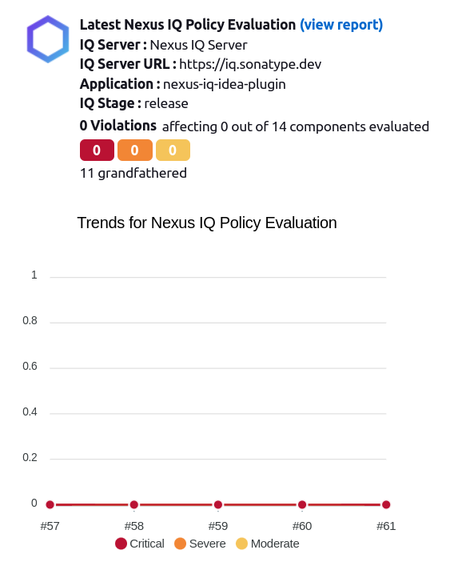
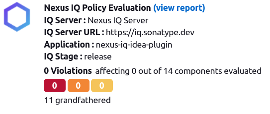
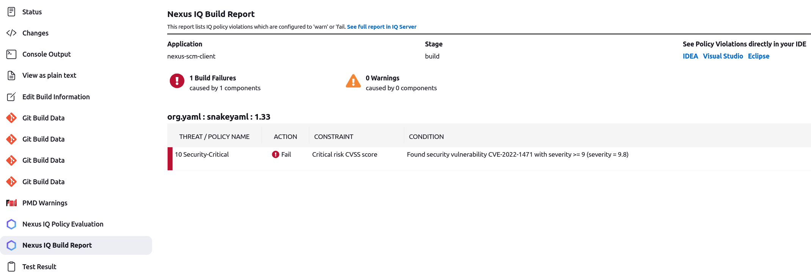

<!--

    Copyright (c) 2016-present Sonatype, Inc. All rights reserved.

    This program is licensed to you under the Apache License Version 2.0,
    and you may not use this file except in compliance with the Apache License Version 2.0.
    You may obtain a copy of the Apache License Version 2.0 at http://www.apache.org/licenses/LICENSE-2.0.

    Unless required by applicable law or agreed to in writing,
    software distributed under the Apache License Version 2.0 is distributed on an
    "AS IS" BASIS, WITHOUT WARRANTIES OR CONDITIONS OF ANY KIND, either express or implied.
    See the Apache License Version 2.0 for the specific language governing permissions and limitations there under.

-->

# Document Purpose

This page provides high-level technical information regarding the **Nexus Platform Plugin for Jenkins**.

## Product Overview

For an overview of the product and its features see the plugin's public [help page][1]. 
The [README.md](../README.md) acts as a change log, so please refrain from making any manual changes there.

## High-Level Technical Description

For more details about Jenkins plugin architecture go to [Jenkins Developer Documentation][3].

The plugin consists of a series of custom Jenkins job steps that can be used in both declarative and freestyle jobs and 
a set of UI fragment used either for configuration purposed, or for displaying the custom steps results.

There are some global configuration classes, under [org/sonatype/nexus/ci/config](../src/main/java/org/sonatype/nexus/ci/config), 
which allow user to configure Nexus IQ Server or NXRM connection details at job level.

The code that deals with scanning and policy evaluations lives under [org/sonatype/nexus/ci/iq](../src/main/java/org/sonatype/nexus/ci/iq).
The code entry point for this feature is: [org.sonatype.nexus.ci.iq.IqPolicyEvaluatorBuildStep](../src/main/java/org/sonatype/nexus/ci/iq/IqPolicyEvaluatorBuildStep.groovy).

There are also three action classes that generate UI fragments:
- [PolicyEvaluationHealthAction](../src/main/java/org/sonatype/nexus/ci/iq/PolicyEvaluationHealthAction.groovy) - The latest policy evaluation report summary and trend for a given job



- [PolicyEvaluationProjectAction](../src/main/java/org/sonatype/nexus/ci/iq/PolicyEvaluationProjectAction.groovy) - Policy evaluation report summary and trend for a particular run



- [PolicyEvaluationReportAction](../src/main/java/org/sonatype/nexus/ci/iq/PolicyEvaluationReportAction.groovy) - Build report for a particular run



The code that handles the interaction with NXRM (v2 and v3) lives under [org/sonatype/nexus/ci/nxrm](../src/main/java/org/sonatype/nexus/ci/nxrm).

Both the production and test code are written in Groovy. The UI views are written in [Jelly][4] or Groovy and can be 
composed of a number of different partial views (or view fragments).

The plugin is build using the [maven-hpi-plugin][5].

## Local Development

### Build

To build the project run:
```bash
mvn clean install

# or build without running the tests
mvn clean install -DskipTests
```

### Run and Debug

To start the plugin in Jenkins run:
```bash
mvn hpi:run
```

In IDEA, you can add remote debug params to the line that executes java to use remote debugging: 
`-Xdebug -Xrunjdwp:transport=dt_socket,server=y,suspend=y,address=8000`

You can also create a Maven-based run configuration in IDEA and execute it in run or debug mode.

### Testing

The project's test folder contains unit tests, integration tests and test related utility classes.

All tests can be run in the IDE as regular unit tests (right-click on a test class and choose 'Run' or 'Debug').

It uses Wiremock to simulate a working IQ Server - see: [IqServerMockUtility](../src/test/java/org/sonatype/nexus/ci/iq/IqServerMockUtility.groovy).

All tests rely on `org.jvnet.hudson.test.JenkinsRule`, provided by the `jenkins-test-harness`
dependency, which is a stripped down version of Jenkins runtime created for testing purposes.
 
> **Important Note**: A very important difference between the `JenkinsRule` and the real Jenkins runtime is the class 
> loader hierarchy: the production runtime uses a class loader tree (for more details go to: [Class loading in Jenkins][2]), 
> while the test rule uses a single classloader for everything.
> This makes impossible to detect via testing if the plugin conflicts with other Jenkins dependencies/plugins in a 
> production environment, so before releases a quick manual sanity check is required (more details in the release instructions).

## CI/CD Notes

The plugin resides GitHub in a different organization i.e. **jenkinsci**: https://github.com/jenkinsci/nexus-platform-plugin

For that reason the CI build process is a bit different from other Sonatype projects.

The main Jenkins job - [Jenkinsfile](../Jenkinsfile) - runs in the Jenkins CI infrastructure (outside Sonatype).
[Jenkinsfile.sonatype](../Jenkinsfile.sonatype) - is the file behind our snapshot builds (inside Sonatype).

On release the final artifact is pushed to [Jenkins CI artifact repository][6] and Sonatype's https://repo.sonatype.com/. 

## Troubleshooting

### Stax2 implementation conflict

**Problem**:

Conflicting dependencies in Jenkins:

Jenkins provided jar:
```
[INFO] org.sonatype.nexus.ci:nexus-jenkins-plugin:hpi:3.11-SNAPSHOT
[INFO] \- org.jenkins-ci.main:jenkins-core:jar:2.7:provided
[INFO]    \- org.codehaus.woodstox:wstx-asl:jar:3.2.9:provided
```

Bundled with nexus-java-api v3.38:
```
[INFO] com.sonatype.insight.scan:insight-scanner-archive:jar:2.29.1-SNAPSHOT
[INFO] \- org.cyclonedx:cyclonedx-core-java:jar:4.1.2:compile
[INFO]    \- com.fasterxml.jackson.dataformat:jackson-dataformat-xml:jar:2.12.3:compile
[INFO]       \- com.fasterxml.woodstox:woodstox-core:jar:6.2.4:compile
```

Both jars contain similar classes with the same qualified names. The provided jar (which contains older classes) has 
priority in the class loader, but the bundled one (with newer classes) is needed by the plugin.

**Solution (old)**:

The conflicting classes and their dependencies are relocated in nexus-java-api, creating an isolated space for the 
plugin to execute all Stax2 operations. For details see: https://github.com/sonatype/nexus-java-api/pull/163/files

**Note**: This solution is no longer working as of Mar 22. 2022. We should still keep it here for reference.

**Solution (new)**:

By using the `<maskClasses>` feature of the [maven-hpi-plugin][5] we can mask certain packages from Jenkins-core. 
That makes them unavailable to the plugin, forcing the plugin to use its own bundled packages.

E.g.
```xml
<plugin>
    <groupId>org.jenkins-ci.tools</groupId>
    <artifactId>maven-hpi-plugin</artifactId>
    <extensions>true</extensions>
    <configuration>
        <maskClasses>
            com.fasterxml.jackson.
            org.cyclonedx.
            org.codehaus.stax2.
            com.ctc.wstx.
        </maskClasses>
    </configuration>
</plugin>
```

### Stax's implementation provided by Jenkins does not work with multiple service implementations

**Problem**:

Stax expects that implementations are provided for several service interfaces e.g. `hidden.javax.xml.stream.XMLOutputFactory`. 
In case multiple implementations are provided for the same service, the first one found is always used. 

Jenkins provides implementations for all the Stax services, and those implementations will be used by Jenkins and 
plugins, because Jenkins-core is always loaded first. The current mechanism prevents plugins to provide and use
different/newer Stax/Stax2 implementations.

**Solution**:

Plugins that require newer Stax/Stax2 functionality have to provide their own relocated Stax/Stax2 stack, to not 
interfere with the Stax/Stax2 classes used by Jenkins.


### Some (old) libraries assume there is only one class loader

**Problem**:

Jenkins uses a hierarchy of class loaders as shown below (for more details go to: [Class loading in Jenkins][2]):
```
□ Java Platform
 ↖
  □ “application classpath” (servlet container): java -jar jenkins.war
   ↖
    □ Jenkins core: jenkins.war!/WEB-INF/lib/*.jar
     ↖
      □ plugin A: $JENKINS_HOME/plugins/a.jpi!/WEB-INF/lib/*.jar
       ↖                                                             ↖
        □ plugin C: $JENKINS_HOME/plugins/c.jpi!/WEB-INF/lib/*.jar  ← □ UberClassLoader
     ↖ ↙                                                             ↙
      □ plugin B: $JENKINS_HOME/plugins/b.jpi!/WEB-INF/lib/*.jar
      ⋮
```

Some old java libraries (e.g. stax-api) assume the only one class loader exists, retrieve it using 
`Thread.currentThread().getContextClassLoader()` and use it exclusively. 

That class loader corresponds to the Jenkins core entry in the above hierarchy, and it has access only to the 
jenkins-core packages (bundled in _jenkins.war_), but it cannot access any of the plugins provided classes.  

**Solution**:

Make sure the plugin class loader is used as a context class loader by the current thread.

E.g. in a class where you experience unexpected `ClassNotFoundExceptions` add:
```groovy  
  // get plugin's ClassLoader
  ClassLoader classLoader = this.class.classLoader
  // set context ClassLoader for current thread
  Thread.currentThread().setContextClassLoader(classLoader)
```

## References

### Jenkins

- [Plugin's help page][1]
- [Guide to Developing Jenkins Plugins][3]
- [Dependencies and class loading][2]
- [Apache Jelly][4]
- [maven-hpi-plugin][5]
- [Jenkins CI artifact repository][6]


[1]: https://help.sonatype.com/iqserver/integrations/nexus-and-continuous-integration/nexus-platform-plugin-for-jenkins
[2]: https://www.jenkins.io/doc/developer/plugin-development/dependencies-and-class-loading/
[3]: https://www.jenkins.io/doc/developer
[4]: https://commons.apache.org/proper/commons-jelly
[5]: https://jenkinsci.github.io/maven-hpi-plugin
[6]: https://repo.jenkins-ci.org/
